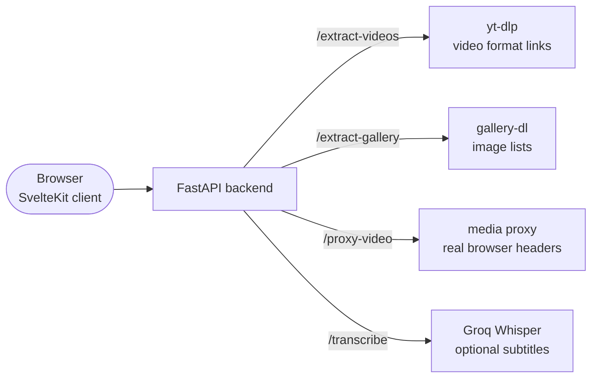

# MediaPull


MediaPull turns a page URL into downloadable video formats and/or image
galleries. Paste a link, extract, then preview, download, or copy. Optional
speech-to-text subtitles (Groq Whisper), cookie support for signed-in sites,
and a media proxy when the browser can’t play a source directly.

Uses [yt-dlp](https://github.com/yt-dlp/yt-dlp) for video and
[gallery-dl](https://github.com/mikf/gallery-dl) for images.

## Features

- **Extract video formats** — qualities and container types, ready to preview,
  download, or copy
- **Image galleries** — pull albums/galleries with per-image and bulk download
- **Built-in player** — preview in the page; switch quality without leaving
- **Auto / Video / Gallery** — Auto detects type; force Video or Gallery from
  the extract bar when you already know
- **Optional subtitles** — speech-to-text captions when `GROQ_API_KEY` is set
- **Proxy mode** — stream through the backend when direct play fails (hotlink
  protection, missing Referer/Cookie headers)
- **Sign-in cookies** — Settings → Sign-in for sites that need a login
- **Bilingual** — English and Persian (RTL-aware)

## Quick start

### 1. Install

```bash
git clone https://github.com/meowbey/MediaPull.git
cd mediapull
```

**Server** (Python 3.10+):

```bash
cd server
pip install -r requirements.txt
cp .env.example .env        # optional: CORS_ORIGINS, GROQ_API_KEY, COOKIE_FILE_PATHS, …
```

**Client** (Node.js 18+):

```bash
cd client
npm install
cp .env.example .env        # leave VITE_API_BASE_URL empty in dev (Vite proxies)
```

### 2. Run

```bash
# Terminal 1 — backend
cd server
uvicorn app.main:app --reload      # or: python run.py

# Terminal 2 — frontend
cd client
npm run dev
```

Open **http://localhost:5173** — the Vite dev server proxies API routes to
http://localhost:8000 (including `/proxy-token`).

### 3. Use it

1. Paste a URL into the input field.
2. Leave mode on **Auto** (or pick **Video** / **Gallery**), then **Extract**.
3. Preview, then **Download** or **Copy** the link you want.
4. For login-only sites, add cookies in **Settings → Sign-in** and try again.

Want subtitles? Set `GROQ_API_KEY` in `server/.env`, then use **Subtitles** on
a video card.

## How it works

The browser never talks to the source site — only to the MediaPull backend.
That's the whole trick: the backend can send the `Referer` / `Cookie` /
`User-Agent` headers a plain `<video>` tag cannot, so extraction and playback
work on sites that block hotlinking or require a login.



**Worth knowing:**

- **Cookies stay off proxy URLs.** Before a proxy URL is built, auth cookies
  are swapped for a short-lived opaque token (`ctok` via `/proxy-token`), so
  copied, QR'd, or shared links never expose a session.
- **Single-worker by design.** Result cache, transcription jobs, and proxy
  tokens are in-memory per process — scale with more instances behind a load
  balancer, not more workers in one process.
- **Keep scrapers current.** When extraction breaks after site changes, upgrade
  yt-dlp/gallery-dl (`pip install -U yt-dlp gallery-dl`). There is no built-in
  auto-update of those tools.

## Testing

```bash
# Server (from server/)
ruff check app/
pytest -q

# Client (from client/)
npm run check
npm run lint
npm test
```

## Documentation

- **[Server setup](server/README.md)** — backend config, env vars, security
- **[Client setup](client/README.md)** — frontend build, routing, dev mode
- **[Deployment](deploy/README.md)** — VPS install (systemd + nginx/Caddy)

## Production notes

- Pin `CORS_ORIGINS` to your real frontend origin(s) (not `*`) if you need
  credentialed cross-origin requests.
- On a public VPS, set `PROXY_ALLOWED_HOSTS` to known media CDNs so the media
  proxy isn’t an open relay.
- Upgrade `yt-dlp` when extraction fails against sites that change often.

## Responsible use

MediaPull is a tool for pulling media you are **authorized to download** — your
own uploads, content you have rights to, or material whose license permits it.
You are responsible for complying with the terms of service of the sites you
point it at and with the copyright law of your jurisdiction. Don't use it to
infringe copyright or bypass access controls you aren't entitled to.
